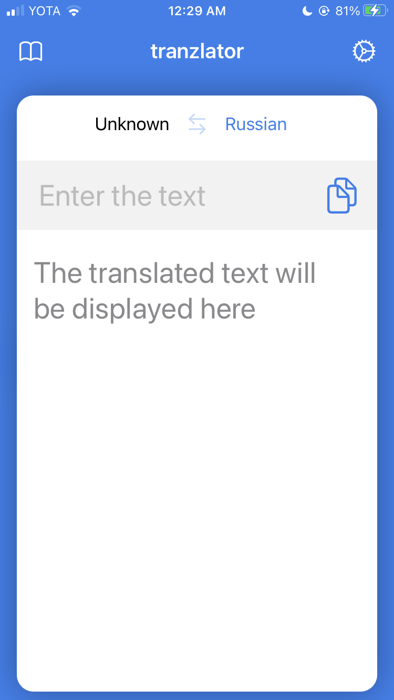

# tranzlator
This is a SwiftUI Translator app using Google Cloud Services, Firebase, Google Auth, Realm and Alamofire.

### Design
[Watch the video](https://vimeo.com/593887359) with the erasing animation.

### Google Services
Here you can find the **Google Sign In** which is installed via the Google Sign In pod. 
Also, **Firebase** storing the entries is installed via the respective pod. 
**Google Cloud Translation** requests are fetched via **Alamofire** to a specific JSON Serialized model. 
Some of my recent projects use **Moya** for that purpose.

### Realm
All the entries are also stored on the phone via **Realm**. 
Though this is not a Combine database model subscription scheme, it loads and fetches the data into the published models correctly. 
However, there are no Firebase and Realm synchronization system, so the Firestore seems to be kept as a database recovery option.

### SwiftUI
Basically, no Introspect in the projects indicates the ability of SwiftUI to be used to represent even some ceative ideas and views. 
There are 3 main classes publishing values for the views. Those are GIDSignIn Controller, API, and Database classes. 
All of them use some viewmodels to store the values, such as: in and out sign in states, json translation model, and the requests history model respectively.

### What can be changed
Some views hierarchy gets incredibly complicated passing thru all those 3 important classes which leads to an idea of making them all a little more dependant, 
providing some clear interface in a form of another viewmodel.

All the Google Cloud requests should be performed via Moya.

A bit more classes to separate the functionality and responsibilities between them.
